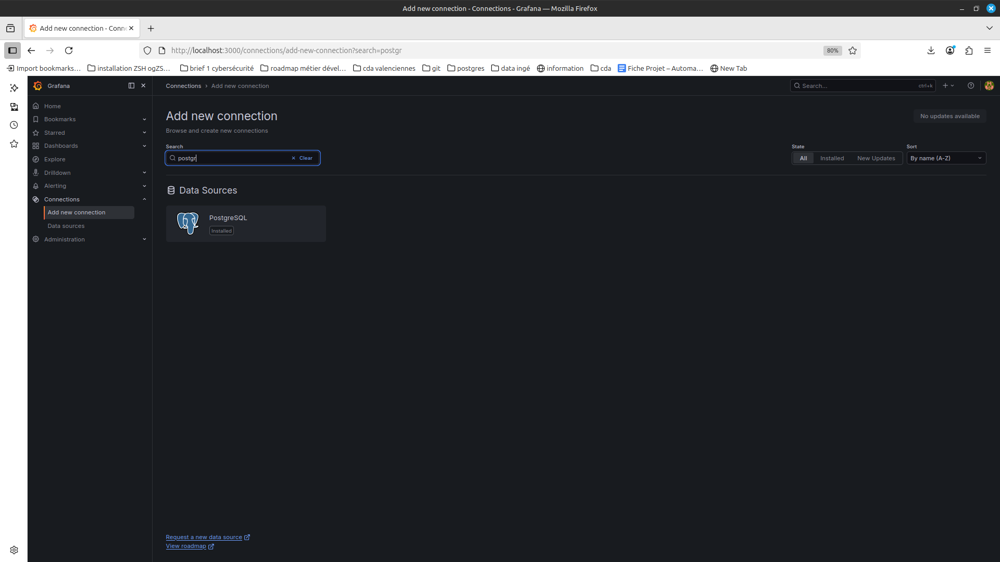
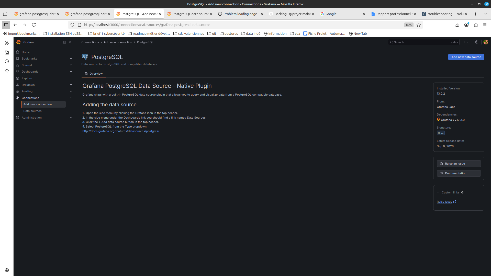
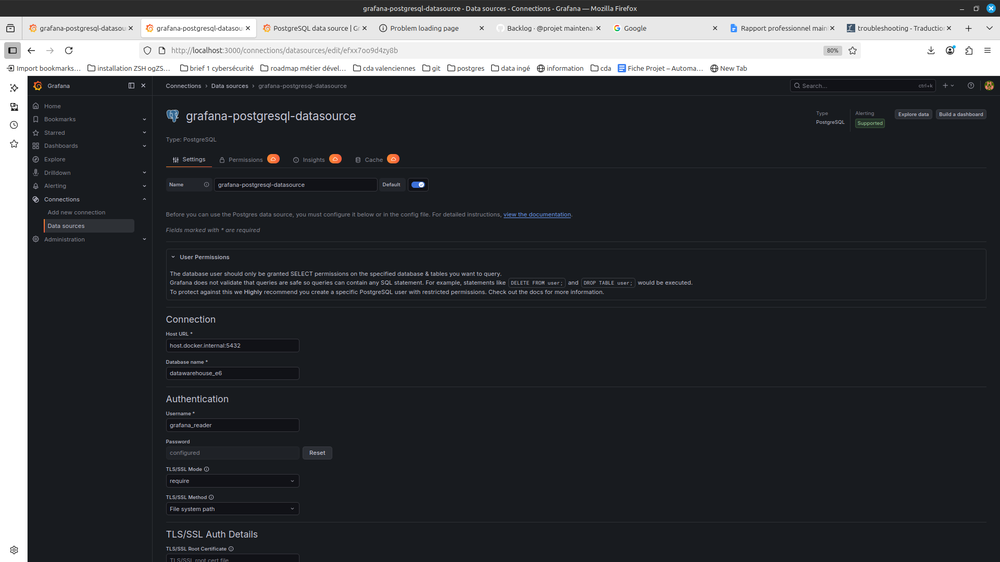
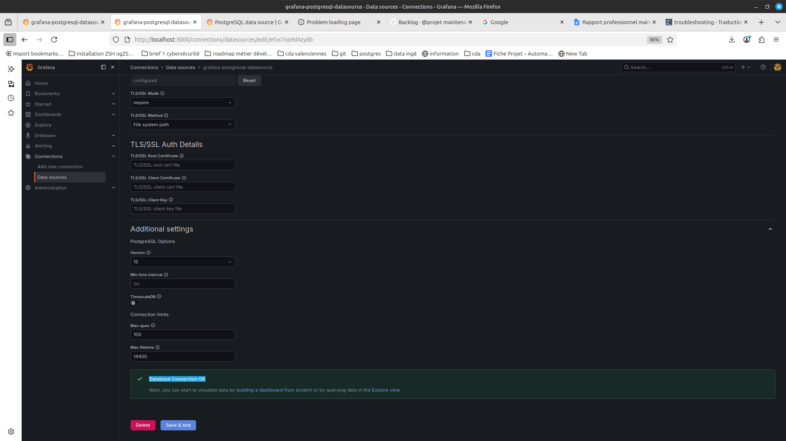

# Entrepôt de données — VenteRapide

## Contexte

Entrepôt de données e-commerce fourni dans le cadre de l'épreuve **E6**
de la certification RNCP 37638 Data Engineer.

La société fictive **VenteRapide** exploite une boutique en ligne généraliste.
Cet entrepôt centralise les données de commandes, produits, clients, visites et retours.

## Stack technique

| Composant       | Technologie                |
| --------------- | -------------------------- |
| Base de données | PostgreSQL 16              |
| Transformation  | dbt 1.11                   |
| Modélisation    | Schéma en étoile (Kimball) |
| Environnement   | Linux / WSL2               |

## Prérequis

- PostgreSQL installé et démarré
  `psql --version`
  `pg_isready`
- dbt installé : `pip install dbt-postgres`

## Installation

### 1. Récupérer le projet

cloner le dépôt

```bash
git clone https://github.com/aReynier/maintenance_warehouse_vente_rapide.git
```

Créer le fichier d'environnement à partir du modèle et configurer vos identifiants locaux :

```bash
cp .env.example .env
```

### 2. Créer la base de données PostgreSQL

Charger les variables du .env

```bash
export $(cat .env | grep -v '^#' | xargs)
```

Créer la base, l'utilisateur et appliquer les privilèges :

```bash
sudo -u postgres psql -c "CREATE DATABASE ${POSTGRES_DB};"
sudo -u postgres psql -c "CREATE USER ${POSTGRES_ADMIN} WITH PASSWORD '${POSTGRES_PASSWORD}';"
sudo -u postgres psql -c "GRANT ALL PRIVILEGES ON DATABASE ${POSTGRES_DB} TO ${POSTGRES_ADMIN};"
sudo -u postgres psql -d ${POSTGRES_DB} -c "GRANT ALL ON SCHEMA public TO ${POSTGRES_ADMIN};"
sudo -u postgres psql -d ${POSTGRES_DB} -c "ALTER DEFAULT PRIVILEGES IN SCHEMA public GRANT ALL ON TABLES TO ${POSTGRES_ADMIN};"
```

Possibilité de lancer Postgres avec l'admin de la façon suivante:

```bash
psql -h ${POSTGRES_HOST} -p ${POSTGRES_PORT} -U ${POSTGRES_ADMIN} -d ${POSTGRES_DB}
```

### 3. Mise en place des paramètres de log Postgres

Pour plus de détails, consulter la page de doumentation dédiée au système de logs:
[Journalisation et monitoring pour Postgres](./docs/journalisation_monitoring.md#1-journalisation-postgresql.md)

Exécuter le script de configuration :

```bash
psql -U ${POSTGRES_SUPERUSER} -d ${POSTGRES_DB} -f scripts/setup_postgres_logging.sql
```

Redémarrer postgres:

```bash
sudo systemctl restart postgresql
```

Pour tester si les logs correspondent bien à l'attendu:

```bash
psql -h ${POSTGRES_HOST} -p ${POSTGRES_PORT} -U ${POSTGRES_SUPERUSER} -d ${POSTGRES_DB} -c "
SELECT name, setting, unit, context
FROM pg_settings
WHERE name IN (
    'logging_collector',
    'log_directory',
    'log_filename',
    'log_min_duration_statement',
    'log_statement',
    'log_temp_files',
    'log_lock_waits'
);"
```

### 3. (recommandé) Créer l'environnement virtuel du dépôt

Proposition avec venv

```bash
python3 -m venv .venv
source .venv/bin/activate
```

### 4. Installer les librairies du projet

Installer les librairies listées dans le requirements

```bash
pip install -r requirements.txt
```

Ce requirement contient comme librairies principales:

- dbt-postgres

### 5. Configurer le profil dbt

Créer le fichier `~/.dbt/profiles.yml` à la racine de sa propre machine et ajouter :

```yaml
datawarehouse_e6:
  target: dev
  outputs:
    dev:
      type: postgres
      host: "{{ env_var('POSTGRES_HOST', 'localhost') }}"
      port: "{{ env_var('POSTGRES_PORT', '5432') | int }}"
      user: "{{ env_var('POSTGRES_ADMIN') }}"
      password: "{{ env_var('POSTGRES_PASSWORD') }}"
      dbname: "{{ env_var('POSTGRES_DB') }}"
      schema: public
      threads: 4
```

### 6. Vérifier la connexion

```bash
dbt debug
```

### 7. Mettre en place le tableau de bord grafana

Ajouter l'utilisateur dédié à Grafana:

```bash
sudo -u postgres psql -d "${POSTGRES_DB}" -c "
CREATE USER ${GRAFANA_USER} WITH PASSWORD '${GRAFANA_USER_PASSWORD}';
GRANT CONNECT ON DATABASE ${POSTGRES_DB} TO ${GRAFANA_USER};
GRANT USAGE ON SCHEMA public TO ${GRAFANA_USER};
GRANT SELECT ON ALL TABLES IN SCHEMA public TO ${GRAFANA_USER};
ALTER DEFAULT PRIVILEGES IN SCHEMA public GRANT SELECT ON TABLES TO ${GRAFANA_USER};
"
```

Lancer de docker compose du monitoring:

```bash
docker compose -f docker-compose.monitoring.yml up -d
```

Aller sur l'inteface de Grafana à l'adresse: [http://localhost:3000](http://localhost:3000/)

Entrer les identifiants de Grafana fournis dans le .env GRAFANA_USER et GRAFANA_USER_PASSWORD

Dans l'interface de Grafana, ajouter la connexion de spogres avec les identifiants et le nom de la base de données:





Si la connexion postgres à Grafana bloque, employer
[Dépannage](./docs/depannage.md)

### 7. Lancer l'entrepôt

Avant la première exécution, il est nécessaire d'installer les dépendances (notamment le package de monitoring) et d'initialiser ses tables système.

```bash
dbt deps                            # Installe les packages (dbt_artifacts)
dbt run --select dbt_artifacts      # Crée les tables de logs dbt dans PostgreSQL
dbt seed                            # charge les 5 tables brutes
dbt run                             # construit les 12 modèles
dbt snapshot                        # initialise le SCD type 2
dbt test                            # lance les 66 tests
```

### 8. Développement quotidien

Une fois l'initialisation faite, plus besoin de lancer toutes les commandes ci dessous, seul un simple run suffit:

```bash
dbt run
```

En cas de besoin d'execution ciblée:

```bash
dbt run --select nom_modele
```

En cas de bug ou de lancement dans un cadre spécifique (ex. CI/CD), se référer à la partie dbt du guide de jouranlisation et monitoring:
[Journalisation et monitoring pour dbt](./docs/journalisation_monitoring.md#2-journalisation-dbt)```

## Structure du projet

docs/
methodologie_gestion_de_projet.md
politique_sauvegarde.md
journalisation_monitoring.md
seeds/  
raw_clients.csv  
raw_produits.csv  
raw_commandes.csv  
raw_lignes_commande.csv  
raw_visites.csv  
models/
staging/ ← nettoyage et typage des données brutes  
dimensions/ ← dim_client, dim_produit, dim_date, dim_canal, dim_statut_commande  
facts/ ← fact_commandes, fact_visites  
snapshots/  
scd_client.sql ← SCD type 2 sur dim_client (ville, code_postal, segment)
CONTRIBUTING.md
README.md

## Utilisateurs PostgreSQL

| Utilisateur    | Droits                           | Usage                   |
| -------------- | -------------------------------- | ----------------------- |
| postgres       | Superadmin système               | Urgence uniquement      |
| grafana_reader | lcture de la table grafanareader | tableau de bord grafana |
| dbt_admin      | admin + Lecture/écriture         | Admin + Pipeline dbt    |

## Documentation interactive

```bash
dbt docs generate
dbt docs serve --port 8080
```

Ouvrez ensuite http://localhost:8080 pour accéder au lineage graph (icône en bas à droite sur l'interface web dbt).

## Restauration depuis un backup

Se référer au guide détaillé :
[politique de sauvegarde](./docs/politique_sauvegarde.md)
Vous y trouverez :

- La procédure de restauration pour un backup complet (DRP)
- La procédure de sauvegarde et restauration partielle (schéma / table)

## Dépannage

A tout moment, si vous êtes bloqué, cette partie de la documentation vous aidera peut être à vous débloquer:
[Dépannage](./docs/depannage.md)
